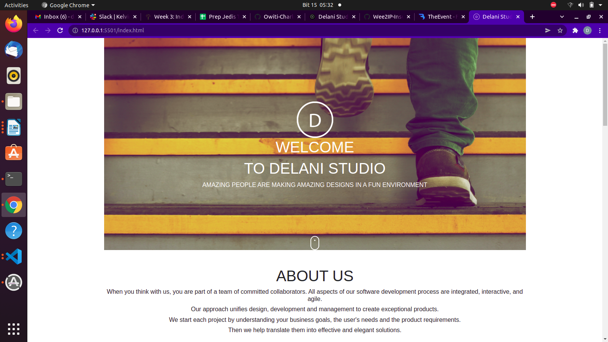
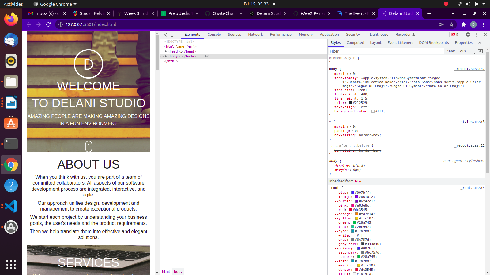

##### DENIS MUGA
### A Description of Delani Studio Web Application
## Table of Content
+ [Description](#description)
+ [Installation Requirement]( Requisites)
+ [Behavior-Driven-Development](#BDD)
+ [Technology Used](#technology-used)
+ [Live-links] (#Live links)
+ [Reference](#reference)
+ [Licence](#licence)
+ [Authors Info](#aut)
##Description
This a web application about a software company - Delani Studio on the services it offers. The application shows key information about the studio, its portfolio on past projects, and a contact page that enables users to contact the company using a form by sending the names, email address, and a short message.
 This is the desktop rendition.
  This is the mobile rendition.
## Set-up
### Vitals
* A computer or a desktop in good working condition.
* A stable internet connection to enable continuous adding and commiting HTML and CSS changes into the project's repository.
### Installation Process
* A mandatory git initialization at the beginning of the project to enable adding and commiting changes to external (remote) repository.
##BDD
| Behaviour      | Input        | Output       |
| :------------- | :----------: | -----------: |
|  Enter your name  |   Denis Muga |     |
| Enter your Email Address  | mugah2011@gmail.com |   |
| Enter your message or comment   |  I would love to work with you     |     |
| Press Submit|     |Pop up "Denis Muga , we have received your message. Thank you for reaching out to us.|
| Click What We Do Area|   Click on Images  |The Images Swipe Across as the Information on What We Do Pops |
| Hover on Images|  Hover Images   |On hover a white box appears with then name of the project inside. The project picture is still  visible in the background.|

## Technology Used
* Vanilla HTML is essential in building this project.
* CSS for styling the webpage by incorporating key concepts such as display, align-contents, justify-content, width, float, classes, IDs, background color, and box-model, among others.
* Javascript to offer functionality to the application.
*Node js.
*Bootstrap
*JQuery Library- a Javascript Framework
## The live link
To get a demenonstration of the final deployment of my page please follow this link
The demonstration of the project's live deployment is available in the link below:
[live-link](https://github.com/DenisMuga/Delani-Studio)
## Reference
  ### The reference materials used in this project can be accessed though this link
  * [Resource](https://github.com/jonnygovish/IP3) - For project's assets.
  ## Licence
MIT License
Copyright (c) [2022] [Denis Muga]
Permission is  granted, free of charge, to any person obtaining a copy
of this software and associated documentation files (the "Software"), to deal
in the Software without restriction, including without limitation the rights
to use, copy, modify, merge, publish, distribute, sublicense, and/or sell
copies of the Software, and to permit persons to whom the Software is
furnished to do so, subject to the following conditions:
The above copyright notice and this permission notice shall be included in all
copies or substantial portions of the Software.
THE SOFTWARE IS PROVIDED "AS IS", WITHOUT WARRANTY OF ANY KIND, EXPRESS OR
IMPLIED, INCLUDING BUT NOT LIMITED TO THE WARRANTIES OF MERCHANTABILITY,
FITNESS FOR A PARTICULAR PURPOSE AND NONINFRINGEMENT. IN NO EVENT SHALL THE
AUTHORS OR COPYRIGHT HOLDERS BE LIABLE FOR ANY CLAIM, DAMAGES OR OTHER
LIABILITY, WHETHER IN AN ACTION OF CONTRACT, TORT OR OTHERWISE, ARISING FROM,
OUT OF OR IN CONNECTION WITH THE SOFTWARE OR THE USE OR OTHER DEALINGS IN THE
SOFTWARE.
## Authors Info
Slack Profile - Denis Muga.
LinkedIn - (Denis Muga: https://www.linkedin.com/in/denis-mugah-0595b655/)
Email - denismugah5@gmail.com
Mobile: +254 712 858 753